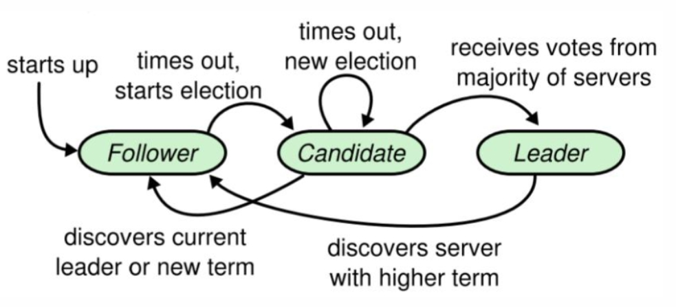
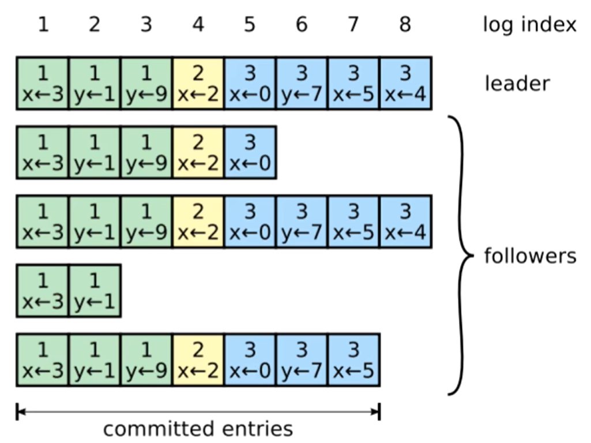
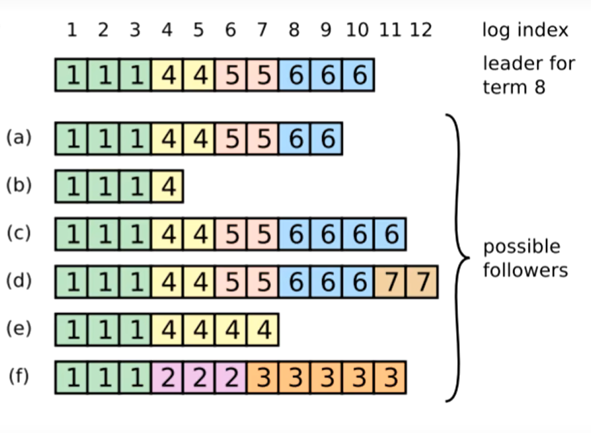

如何应对网络的不可靠以及节点的失效?
1. 可读写
2. 可读
3. 不可用
### 问题
1. 网络不确定性:在非拜占庭情况下,出现网络分区/冗余/丢失/乱序等问题
下要保证正确
2. 基本可用性:集群中大部分节点能够保持相互通信,那么集群就应该能够
正确响应客户端 
3. 快速响应:对客户端请求的响应不能依赖集群中最慢的节点
### 一个可行解
1. 初始化的时候有一个leader节点,负责发送日志到其他follower,并决定日志顺序(solve 1)
2. 当读请求到来时,在任意节点都可以读,而写请求只能重定向到leader进行
3. leader先写入目己的日志,然后同步给半数以上节点(solve 3),follower表示都ok了,leader才提交日志
4. 日志最终由leader先按顺序应用于状态机,其他follower随机应用到状态机
5. 当leader crash,其它follower通过心跳感知选举出新的leader继续集群的正常运转
6. 当有新的节点加入或退出集群,需要将配置信息同步给整个集群
### Raft



在某些情况下,一次选举无法选出leader(比如两个节点收到了相同的票数),
在这种情况下,这一任期会以没有leader结束;一个新的任期(包含一次新的选举)会很快重新开始

服务器之间通信的时候会**交换**当前任期号;如果一个服务器上的当前任期号比其他的小,
该服务器会将自己的任期号更新为较大的那个值.

如果一个candidate或者leader发现自己的任期号过期了,它会立即回到follower状态.
如果一个节点接收到一个包含过期的任期号的请求,它会直接拒绝这个请求.
#### 领导者选举
开始一个选举过程后,follower先增加自己的当前任期号,并转换到candidate状态,
然后投票给自己,并且并行地向集群中的其他服务器节点发送投票请求

#### 日志复制
>是不是日志复制到了超过半数的节点后,就百分百会提交呢?

因为follower复制完成到follower通知leader,再到leader完成提交,是需要时间的.
这个时间内leader如果宕机了,这条日志虽然复制到了超过半数的节点,但没能提交.



> 那么怎么让这些follower追上leader?
> 并保证所有节点的日志都是完整且顺序一致的呢?

1. follower缓慢: leader不断重发AppendEntries RPC,直至follower**追上**,哪怕leader已经回复了客服端(意味着日志已经复制给了超过半数节点且leader已经提交了日志)
2. follower宕机: 追加条目的**一致性检查**生效,保证follower能按顺序恢复崩溃后的日志.崩溃后可能换了几个leader,当前leader并不知道他在宕机前日志复制到哪里了.leader在每一个发往follower的追加条目RPC中,会放入前一个日志条目的索引位置和任期号.
   如果follower在他的日志中找不到前一个日志,那么他就会拒绝此日志,leader收到follower的拒绝后会发送前一个日志条目,从而逐渐向前定位到follower第一个缺失的日志.
3. leader宕机: 如果leader崩溃,那么崩溃的leader可能已经复制了日志到部分follower但还没有提交,
   而被选出的新leader又可能不具备这些日志,
   这样就有部分follower中的日志和新leader的日志不相同.<br>
   Raft在这种情况下,leader通过强制follower
   复制它的日志来解决不一致的问题,这意味着follower中跟leader冲突的日志条目会被新leader的日志条目覆盖
   (因为没有提交,所以不违背外部一致性)
   
   如果是已经提交的日志那么新的leader中
   

  

   当然也有可能当前的leader宕机,这个时候a c d有机会当上leader,
   而c和d如果当上了leader,就可以把自己多出的日志复制给follower,
   来使自己多出的日志提交.

```go
// 追加日志 RPC Request
type AppendEntriesRequest struct {
   term int // 自己当前的任期号
   leaderId int // leader( 也就是自己 ) 的 ID
   
   // 用于一致性检查
   prevLogIndex int // 前一个日志的日志号
   prevLogTerm int // 前一个日志的任期号
   entries []byte // 当前日志体
   
   leaderCommit int // leader 的已提交日志号
   /*
   对于follower,接收到了leader的日志,并不能立即提交,
   因为这时候还没有确认这个日志是否被复制到了大多数节点,
   leader确定了日志被复制到了大多数节点,才会提交,
   然后leader在 AppendEntries RPC中把这个信息告知follwer
   follower就可以把自己复制但未提交的日志设为已提交状态
   对于那些还在苦苦追赶日志进度的follower来说,
   leaderCommit大于自己最后一个日志,它的所有日志都可以提交
   */
}

// 追加日志 RPC Response
type AppendEntriesResponse struct {
   term int // 自己当前任期号
   success bool 
   // request term >= 自己的term
   // 且request通过一致性检查后才会返回true
}
```

#### 安全性
Raft通过几个补充规则完善整个算法,使算法可以在各类宕机问题下都不出错

日志复制阶段对于日志顺序的保证能生效的前提是leader是正常的.
如果leader出现宕机,他的后几个日志的状态就有可能出现不正常.

新leader是否具备这些不正常的日志,以及怎么处理这些不正常的日志

1. Leader宕机处理：选举限制
2. Leader宕机处理：新leader是否提交之前任期内的日志条目
3. Follower和Candidate宕机处理
4. 时间与可用性限制

> 选民只会投票给任期比自己大,最后一条日志比自己新(任期大或者等于时索引更大)的候选人 ?

> commit消息

 如果客户端请求很稀疏,那么Leader或许要发送一个心跳或者发送一条特殊的AppendEntries消息.
 如果客户端请求很频繁,那就无所谓了.因为如果每秒有1000个请求,那么下一条AppendEntries很快就会发出,你可以在下一条消息中带上新的commit号,而不用生成一条额外的消息.额外的消息代价还是有点高的,反正你要发送别的消息,可以把新的commit号带在别的消息里.

> 如果有一场新的选举,有可能之前的Leader仍然在运行,并认为自己还是Leader.
> 例如,当出现网络分区时,旧Leader始终在一个小的分区中运行,而较大的分区会进行新的选举,最终成功选出一个新的Leader.
> 这一切,旧的Leader完全不知道.所以我们也需要关心,在不知道有新的选举时,旧的Leader会有什么样的行为?

假设网线故障了,旧的Leader在一个网络分区中,这个网络分区中有一些客户端和少数(未过半)的服务器.在网络的另一个分区中,有着过半的服务器,这些服务器选出了一个新的Leader.旧的Leader会怎样,或者说为什么旧的Leader不会执行错误的操作？这里看起来有两个潜在的问题.第一个问题是,如果一个Leader在一个网络分区中,并且这个网络分区没有过半的服务器.那么下次客户端发送请求时,这个在少数分区的Leader,它会发出AppendEntries消息.但是因为它在少数分区,即使包括它自己,它也凑不齐过半服务器,所以它永远不会commit这个客户端请求,它永远不会执行这个请求,它也永远不会响应客户端,并告诉客户端它已经执行了这个请求.所以,如果一个旧的Leader在一个不同的网络分区中,客户端或许会发送一个请求给这个旧的Leader,但是客户端永远也不能从这个Leader获得响应.所以没有客户端会认为这个旧的Leader执行了任何操作.另一个更奇怪的问题是,有可能Leader在向一部分Followers发完AppendEntries消息之后就故障了,所以这个Leader还没决定commit这个请求.这是一个非常有趣的问题,我将会再花45分钟(下一节课)来讲.

> 如果一次选举成功了，整个集群的节点是如何知道的呢？

当一个服务器赢得了一次选举，这个服务器会收到过半的认可投票，
这个服务器会直接知道自己是新的Leader，因为它收到了过半的投票。但是其他的服务器并不能直接知道谁赢得了选举，其他服务器甚至都不知道是否有人赢得了选举。这时，（赢得了选举的）候选人，会通过心跳通知其他服务器。Raft论文的图2规定了，如果你赢得了选举，你需要立刻发送一条AppendEntries消息给其他所有的服务器。这条代表心跳的AppendEntries并不会直接说：我赢得了选举，我就是任期23的Leader。这里的表达会更隐晦一些。Raft规定，除非是当前任期的Leader，没人可以发出AppendEntries消息。
所以假设我是一个服务器，我发现对于任期19有一次选举，
过了一会我收到了一条AppendEntries消息，这个消息的任期号就是19。
那么这条消息告诉我，我不知道的某个节点赢得了任期19的选举。
所以，其他服务器通过接收特定任期号的AppendEntries来知道，选举成功了。

> 任何一条AppendEntries消息都会重置所有Raft节点的选举定时器。

> 没有一个节点获得了过半投票，所以也就没有人能被选上。接下来它们的选举定时器会重新计时，因为选举定时器只会在收到了AppendEntries消息时重置，但是由于没有Leader，所有也就没有AppendEntries消息。

> 因为Raft论文的图2规定了，nextIndex的初始值是从新任Leader的最后一条日志开始
> 而Leader在收到了Followers对于AppendEntries的肯定的返回之后，它会增加相应的nextIndex到14。

> 如果你去看处理RequestVote的代码和Raft论文的图2，当某个节点为候选人投票时，节点应该将候选人的任期号记录在持久化存储中。

### students-guide-to-raft
> 当您收到AppendEntry或 RequestVote RPC 时，您可以合理地重置对等方的选举计时器，因为这两者都表明其他对等方要么认为自己是领导者，要么正试图成为领导者。直觉上，这意味着我们不应该干涉。

> 当一个同伴接收到一个心跳时，它应该将其与无心跳的 AppendEntry RPC 区别对待。
> 特别是，许多人只是在接收到心跳时重置他们的选举计时器，然后返回成功，
> **而不执行图2中指定的任何检查**。这非常危险。通过接受 RPC，跟随者隐含地告诉领导者，
> 他们的日志与领导者的日志匹配，并且包含 AppendEntry 参数中包含的 preLogIndex。
> 在收到答复后，领导者可能会决定(错误地)某些条目已经复制到大多数服务器，并开始提交它。


> 许多人遇到的另一个问题(通常是在修复上述问题之后)是，在接收到心跳信号后，他们会截断 preLogIndex 之后跟随者的日志，然后追加 AppendEntry 参数中包含的任何条目。
> 这也是不正确的。我们可以再次转到图2:
> **If an existing entry conflicts with a new one (same index but different terms), delete the existing entry and all that follow it.**

这里的**if**是至关重要的。**如果跟随者有领导者发送的所有条目**，跟随者必须不截断其日志。
必须保留领导发送的条目后面的任何元素。这是因为我们可能从领导者那里接收到一个**过时**的 AppendEntry RPC，截断日志将意味着“**收回**”我们可能已经告诉领导者我们的日志中的条目。

> 死锁也是一个常见问题，但是通常可以通过打印获取锁和释放锁来调试

> 一个活锁场景经常出现; 没有领导人被选举，或者一旦一个领导人当选，其他节点开始选举， 迫使最近当选的领导人立即退位。

>只有在下列情况下你才应该重新启动你的选举计时器: 
1. 你从当前领导者那里得到了一个 AppendEntry RPC (如果AppendEntry中的参数已经过时，不应该重置计时器,term?);
2. 你正在启动一个选举;
3. 你给另一个同伴一张选票;

> 如果你已经在当前term投过票，并且请求投票 RPC 的term比你的更大，
> 你应该首先退出并接受他们的任期(从而**重置 votedFor**),然后处理 RPC,这将导致你给予投票权!

#### Incorrect RPC handlers
- 如果某个步骤显示“reply false”，这意味着您应该立即回复，而不是执行任何后续步骤。
- 如果您获得一个 AppendEntries RPC，其 prevLogIndex 指向您的日志末尾之外，您应该像处理该条目一样处理它，但term不匹配（即回复 false）。
- 即使领导者没有发送任何条目，AppendEntries RPC 处理程序也应该被执行。
- AppendEntries 的最后一步（#5）中的 min 是必需的，它需要用**最后一个新条目的索引**计算。 仅仅让在 lastApplied 和 commitIndex 之间应用日志内容的函数在到达日志末尾时停止是不够的。 这是因为在领导者发送给您的条目（都与您的日志中的条目匹配）之后，您的日志中可能有与领导者日志不同的条目。 因为#3 规定你**只有在有冲突的条目时才截断你的日志**，这些条目不会被删除，如果 leaderCommit 超出了领导者发送给你的条目，你可能会应用不正确的条目。
- 完全按照第 5.4 节中的描述实施“最新日志”检查非常重要。

#### Failure to follow The Rules
> 如果 CommitIndex > lastApplied 在执行期间的任何时候，您应该应用一个特定的日志条目。
> 您将需要有一个专门的“应用程序”，或者锁定这些应用程序，以便其他一些例程也不会检测到需要应用的条目并尝试应用。

> 确保定期检查 commitIndex > lastApplied，或者在更新 commitIndex 之后（即，在更新 matchIndex 之后）。**例如，如果您在向对等方发送 AppendEntries 的同时检查 commitIndex，您可能必须等到下一个条目附加到日志，然后才能应用您刚刚发送并得到确认的条目。???????**

> 如果领导者发送了一个 AppendEntries RPC，但RPC被拒绝了，但不是因为日志不一致（这只有在我们的任期结束时才会发生,由于新的领导者产生了?????），那么你应该立即辞职下台，而不是更新 nextIndex。 如果你这样做，如果你立即连任，你可能与与 nextIndex 的重置产生竞争。**???????**

>  不允许领导者将 commitIndex 更新到前一个任期（或者就此而言，未来任期）的某个地方。 因此，正如规则所说，您特别需要检查 log[N].term == currentTerm。 这是因为 Raft 领导者不能确定一个条目是否真的被提交（并且将来永远不会改变）如果它不是来自他们当前的任期。 本文中的图 8 说明了这一点。**?????????**

>一个常见的混淆来源是 nextIndex 和 matchIndex 之间的区别。 特别是，您可能会观察到 matchIndex = nextIndex - 1，并且根本没有实现 matchIndex。 这不安全。 虽然 nextIndex 和 matchIndex 通常同时更新为相似的值（具体而言，nextIndex = matchIndex + 1），但两者的用途却截然不同。 nextIndex 是对领导者与给定追随者共享什么前缀的猜测。 它通常是相当乐观的（我们分享一切），并且只有在出现负面反应时才会倒退。 例如，当刚刚选举出领导者时，nextIndex 被设置为日志末尾的索引索引。 在某种程度上，nextIndex 用于性能——您只需要将这些东西发送给这个对等点。
>
>matchIndex 用于安全。 它是对领导者与给定追随者共享的日志前缀的保守测量。 matchIndex 不能设置为太高的值，因为这可能导致 commitIndex 向前移动太远。 这就是为什么 matchIndex 被初始化为 -1（即，我们同意没有前缀），并且仅在跟随者肯定确认 AppendEntries RPC 时才更新。

#### [Term confusion](https://thesquareplanet.com/blog/students-guide-to-raft/#term-confusion)

> term混淆是指服务器被来自旧term的 RPC 混淆。 通常，在收到 RPC 时这不是问题，因为图 2 中的规则准确说明了当您看到旧term时应该做什么。 但是，图 2 通常不会讨论当您收到旧的 RPC 回复时应该做什么。 根据经验，我们发现到目前为止最简单的做法是先记录回复中的term（它可能高于您当前的术语），然后将当前term与您在原始 RPC 中发送的term进行比较 . 如果两者不同，则丢弃回复并返回。 只有当这两个术语相同时，您才应该继续处理回复。 您可以通过一些巧妙的协议推理在此处进行进一步的优化，但这种方法似乎效果很好。 不这样做会导致一条充满鲜血、汗水、泪水和绝望的漫长而曲折的道路。
>
> 一个相关但不完全相同的问题是假设在发送 RPC 和收到回复之间您的状态没有改变。 一个很好的例子是当您收到对 RPC 的响应时设置 matchIndex = nextIndex - 1 或 matchIndex = len(log) 。 这是不安全的，因为自从您发送 RPC 后，**这两个值都可能已更新**。 相反，**正确的做法**是根据您最初在 RPC 中发送的参数将 **matchIndex 更新为 prevLogIndex + len(entries[]) 。**

### Raft不能解决的情况


### 2D

raft 接收到 snapshot 之后, service 应用 installSnapShot 的 snapshot 之前 raft 接收到 append entries, append entries可以根据 lastIncluded 判断是否要接收

raft 接收到 old snapshot, 直接不接收 ?

接收 snapshot 改变日志后, 同时持久化

没有改变日志的情况,不持久化 snapshot ?


#### [An aside on optimizations](https://thesquareplanet.com/blog/students-guide-to-raft/#an-aside-on-optimizations)

The Raft paper includes a couple of optional features of interest. In 6.824, we require the students to implement two of them: log compaction (section 7) and accelerated log backtracking (top left hand side of page 8). The former is necessary to avoid the log growing without bound, and the latter is useful for bringing stale followers up to date quickly.

These features are not a part of “core Raft”, and so do not receive as much attention in the paper as the main consensus protocol. Log compaction is covered fairly thoroughly (in Figure 13), but leaves out some design details that you might miss if you read it too casually:

- When snapshotting application state, you need to make sure that the application state corresponds to the state following some known index in the Raft log. This means that the application either needs to communicate to Raft what index the snapshot corresponds to, or that Raft needs to delay applying additional log entries until the snapshot has been completed.

- The text does not discuss the recovery protocol for when a server crashes and comes back up now that snapshots are involved. In particular, if Raft state and snapshots are committed separately, a server could crash between persisting a snapshot and persisting the updated Raft state. This is a problem, because step 7 in Figure 13 dictates that the Raft log covered by the snapshot *must be discarded*.

  If, when the server comes back up, it reads the updated snapshot, but the outdated log, it may end up applying some log entries *that are already contained within the snapshot*. This happens since the `commitIndex` and `lastApplied` are not persisted, and so Raft doesn’t know that those log entries have already been applied. The fix for this is to introduce a piece of persistent state to Raft that records what “real” index the first entry in Raft’s persisted log corresponds to. This can then be compared to the loaded snapshot’s `lastIncludedIndex` to determine what elements at the head of the log to discard.

The accelerated log backtracking optimization is very underspecified, probably because the authors do not see it as being necessary for most deployments. It is not clear from the text exactly how the conflicting index and term sent back from the client should be used by the leader to determine what `nextIndex` to use. We believe the protocol the authors *probably* want you to follow is:

- If a follower does not have `prevLogIndex` in its log, it should return with `conflictIndex = len(log)` and `conflictTerm = None`.
- If a follower does have `prevLogIndex` in its log, but the term does not match, it should return `conflictTerm = log[prevLogIndex].Term`, and then search its log for the first index whose entry has term equal to `conflictTerm`.
- Upon receiving a conflict response, the leader should first search its log for `conflictTerm`. If it finds an entry in its log with that term, it should set `nextIndex` to be the one beyond the index of the *last* entry in that term in its log.
- If it does not find an entry with that term, it should set `nextIndex = conflictIndex`.

A half-way solution is to just use `conflictIndex` (and ignore `conflictTerm`), which simplifies the implementation, but then the leader will sometimes end up sending more log entries to the follower than is strictly necessary to bring them up to date.

### [Applications on top of Raft](https://thesquareplanet.com/blog/students-guide-to-raft/#applications-on-top-of-raft)

When building a service on top of Raft (such as the key/value store in the [second 6.824 Raft lab](https://pdos.csail.mit.edu/6.824/labs/lab-kvraft.html), the interaction between the service and the Raft log can be tricky to get right. This section details some aspects of the development process that you may find useful when building your application.

#### [Applying client operations](https://thesquareplanet.com/blog/students-guide-to-raft/#applying-client-operations)

You may be confused about how you would even implement an application in terms of a replicated log. You might start off by having your service, whenever it receives a client request, send that request to the leader, wait for Raft to apply something, do the operation the client asked for, and then return to the client. While this would be fine in a single-client system, it does not work for concurrent clients.

Instead, the service should be constructed as a *state machine* where client operations transition the machine from one state to another. You should have a loop somewhere that takes one client operation at the time (in the same order on all servers – this is where Raft comes in), and applies each one to the state machine in order. This loop should be the *only* part of your code that touches the application state (the key/value mapping in 6.824). This means that your client-facing RPC methods should simply submit the client’s operation to Raft, and then *wait* for that operation to be applied by this “applier loop”. Only when the client’s command comes up should it be executed, and any return values read out. Note that *this includes read requests*!

This brings up another question: how do you know when a client operation has completed? In the case of no failures, this is simple – you just wait for the thing you put into the log to come back out (i.e., be passed to `apply()`). When that happens, you return the result to the client. However, what happens if there are failures? For example, you may have been the leader when the client initially contacted you, but someone else has since been elected, and the client request you put in the log has been discarded. Clearly you need to have the client try again, but how do you know when to tell them about the error?

One simple way to solve this problem is to record where in the Raft log the client’s operation appears when you insert it. Once the operation at that index is sent to `apply()`, you can tell whether or not the client’s operation succeeded based on whether the operation that came up for that index is in fact the one you put there. If it isn’t, a failure has happened and an error can be returned to the client.

#### [Duplicate detection](https://thesquareplanet.com/blog/students-guide-to-raft/#duplicate-detection)

As soon as you have clients retry operations in the face of errors, you need some kind of duplicate detection scheme – if a client sends an `APPEND` to your server, doesn’t hear back, and re-sends it to the next server, your `apply()` function needs to ensure that the `APPEND` isn’t executed twice. To do so, you need some kind of unique identifier for each client request, so that you can recognize if you have seen, and more importantly, applied, a particular operation in the past. Furthermore, this state needs to be a part of your state machine so that all your Raft servers eliminate the *same* duplicates.

There are many ways of assigning such identifiers. One simple and fairly efficient one is to give each client a unique identifier, and then have them tag each request with a monotonically increasing sequence number. If a client re-sends a request, it re-uses the same sequence number. Your server keeps track of the latest sequence number it has seen for each client, and simply ignores any operation that it has already seen.

#### [Hairy corner-cases](https://thesquareplanet.com/blog/students-guide-to-raft/#hairy-corner-cases)

If your implementation follows the general outline given above, there are at least two subtle issues you are likely to run into that may be hard to identify without some serious debugging. To save you some time, here they are:

**Re-appearing indices**: Say that your Raft library has some method `Start()` that takes a command, and return the index at which that command was placed in the log (so that you know when to return to the client, as discussed above). You might assume that you will never see `Start()` return the same index twice, or at the very least, that if you see the same index again, the command that first returned that index must have failed. It turns out that neither of these things are true, even if no servers crash.

Consider the following scenario with five servers, S1 through S5. Initially, S1 is the leader, and its log is empty.

1. Two client operations (C1 and C2) arrive on S1
2. `Start()` return 1 for C1, and 2 for C2.
3. S1 sends out an `AppendEntries` to S2 containing C1 and C2, but all its other messages are lost.
4. S3 steps forward as a candidate.
5. S1 and S2 won’t vote for S3, but S3, S4, and S5 all will, so S3 becomes the leader.
6. Another client request, C3 comes in to S3.
7. S3 calls `Start()` (which returns 1)
8. S3 sends an `AppendEntries` to S1, who discards C1 and C2 from its log, and adds C3.
9. S3 fails before sending `AppendEntries` to any other servers.
10. S1 steps forward, and because its log is up-to-date, it is elected leader.
11. Another client request, C4, arrives at S1
12. S1 calls `Start()`, which returns 2 (which was also returned for `Start(C2)`.
13. All of S1’s `AppendEntries` are dropped, and S2 steps forward.
14. S1 and S3 won’t vote for S2, but S2, S4, and S5 all will, so S2 becomes leader.
15. A client request C5 comes in to S2
16. S2 calls `Start()`, which returns 3.
17. S2 successfully sends `AppendEntries` to all the servers, which S2 reports back to the servers by including an updated `leaderCommit = 3` in the next heartbeat.

Since S2’s log is `[C1 C2 C5]`, this means that the entry that committed (and was applied at all servers, including S1) at index 2 is C2. This despite the fact that C4 was the last client operation to have returned index 2 at S1.

**The four-way deadlock**: All credit for finding this goes to [Steven Allen](http://stebalien.com/), another 6.824 TA. He found the following nasty four-way deadlock that you can easily get into when building applications on top of Raft.

Your Raft code, however it is structured, likely has a `Start()`-like function that allows the application to add new commands to the Raft log. It also likely has a loop that, when `commitIndex` is updated, calls `apply()` on the application for every element in the log between `lastApplied` and `commitIndex`. These routines probably both take some lock `a`. In your Raft-based application, you probably call Raft’s `Start()` function somewhere in your RPC handlers, and you have some code somewhere else that is informed whenever Raft applies a new log entry. Since these two need to communicate (i.e., the RPC method needs to know when the operation it put into the log completes), they both probably take some lock `b`.

In Go, these four code segments probably look something like this:

```
func (a *App) RPC(args interface{}, reply interface{}) {
    // ...
    a.mutex.Lock()
    i := a.raft.Start(args)
    // update some data structure so that apply knows to poke us later
    a.mutex.Unlock()
    // wait for apply to poke us
    return
}
func (r *Raft) Start(cmd interface{}) int {
    r.mutex.Lock()
    // do things to start agreement on this new command
    // store index in the log where cmd was placed
    r.mutex.Unlock()
    return index
}
func (a *App) apply(index int, cmd interface{}) {
    a.mutex.Lock()
    switch cmd := cmd.(type) {
    case GetArgs:
        // do the get
	// see who was listening for this index
	// poke them all with the result of the operation
    // ...
    }
    a.mutex.Unlock()
}
func (r *Raft) AppendEntries(...) {
    // ...
    r.mutex.Lock()
    // ...
    for r.lastApplied < r.commitIndex {
      r.lastApplied++
      r.app.apply(r.lastApplied, r.log[r.lastApplied])
    }
    // ...
    r.mutex.Unlock()
}
```

Consider now if the system is in the following state:

- `App.RPC` has just taken `a.mutex` and called `Raft.Start`
- `Raft.Start` is waiting for `r.mutex`
- `Raft.AppendEntries` is holding `r.mutex`, and has just called `App.apply`

We now have a deadlock, because:

- `Raft.AppendEntries` won’t release the lock until `App.apply` returns.
- `App.apply` can’t return until it gets `a.mutex`.
- `a.mutex` won’t be released until `App.RPC` returns.
- `App.RPC` won’t return until `Raft.Start` returns.
- `Raft.Start` can’t return until it gets `r.mutex`.
- `Raft.Start` has to wait for `Raft.AppendEntries`.

There are a couple of ways you can get around this problem. The easiest one is to take `a.mutex` *after* calling `a.raft.Start` in `App.RPC`. However, this means that `App.apply` may be called for the operation that `App.RPC` just called `Raft.Start` on *before* `App.RPC` has a chance to record the fact that it wishes to be notified. Another scheme that may yield a neater design is to have a single, dedicated thread calling `r.app.apply` from `Raft`. This thread could be notified every time `commitIndex` is updated, and would then not need to hold a lock in order to apply, breaking the deadlock.